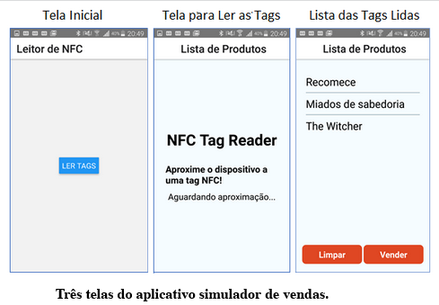
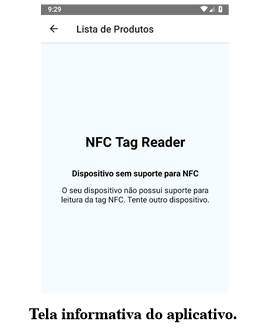

<h2 align="center">
   NFC reader mobile application
</h2>

   

# About
Undergraduate Thesis project in Portuguese with the goal of developing an React application using NFC to read products.
This application can interpret the NFC tags that the cell phone reads. After that, the application translate these tags and show them visually in a list.
* Necessary a cell phone with NFC reader chip.

## Tools
- React Native
- Expo;

## Theses
The Thesis is in Portuguese. You can acess the Theses by this Project github in the package .github/files or by those links: 
* https://drive.google.com/file/d/1CBdIft8KCdQ_W5ulnlTlR7wcrrhBdMAM/view?usp=sharing
* https://github.com/KarinaRovani/NFCReact/blob/master/.github/files/TCC%20Karina%20Rovani%201.0%20-%20Improving%20Sales%20Processes%20with%20NFC.docx

## Layout
<figure>

  
 
  <figcaption>Print of the application's initial screen, screen of reading tags and list of the screen with the read tags</figcaption>

</figure>
 
<figure>

  
 
  <figcaption>Screen stating that the mobile device does not have an NFC reader</figcaption>

</figure>
 

<h5 align="center">
  &copy;2020 - <a href="https://github.com/KarinaRovani/">Karina de Oliveira Rovani</a>
</h5>
